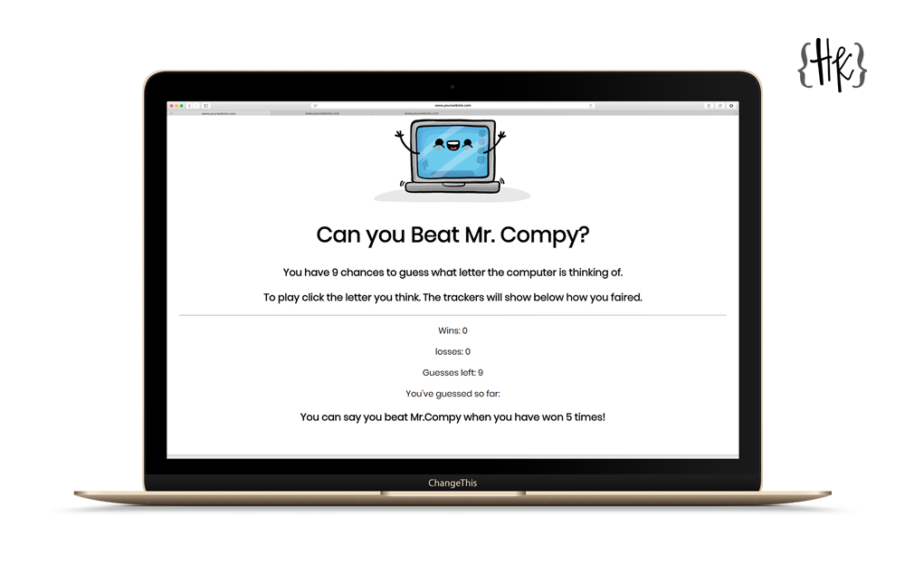

# Can you Beat Mr. Compy?

This is the Week 3 Homework from the UTM Full Stack Developer Bootcamp. I needed to create a game which will run in the browser, and feature dynamically updated HTML and CSS powered by my JavaScript code.

## Tools Used

- HTML
- CSS
- Vanilla Javascript
  - Variables
  - Event Listeners
  - Functions
  - If/Else Statements)

## How to Play:

You have 9 chances to guess what letter the computer is thinking of.

To play click the letter you think. The trackers will show below how you faired.

If you win 5 rounds you have beat the computer!

##Support

If you find an error or bug please [let me know.](https://github.com/CopperCo/BeatTheAI_JS/issues)
